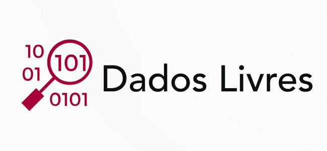

# Dados Livres

Plataforma Livre de Dados Abertos Governamentais para cadastramento e visualização de fontes de dados abertos governamentais e aplicações que fazem uso desse tipo de informação. Afim de promover o controle social e gerar transparência governamental para o público.

[https://dadoslivres.org](https://dadoslivres.org)

# GitLab do Projeto

Projeto continuado no GitLab! Acesse o Link para ter acesso ao código-fonte atualizado do projeto:

[https://gitlab.com/pbaesse/dados-livres](https://gitlab.com/pbaesse/dados-livres)

